# Home SIEM Lab: Attack Simulation & Detection with Splunk

A small home lab where I simulate attacker techniques with Atomic Red Team on a Windows 10 VM and detect them in Splunk using Sysmon and Windows Security logs.

## Architecture

| Component | Role |
|---|---|
| Windows 10 VM (VirtualBox) | Target: Sysmon + Splunk Universal Forwarder, Atomic Red Team |
| Kali Linux VM | Attacker: `smbclient` SMB brute-force source |
| Splunk Enterprise | SIEM, receiving forwarded events on TCP 9997 |

```text
Kali Linux (smbclient) ──┐
                           ├──> Windows 10 (Sysmon + Security log) -> Universal Forwarder -> TCP 9997 -> Splunk Enterprise
Atomic Red Team ──────────┘
```

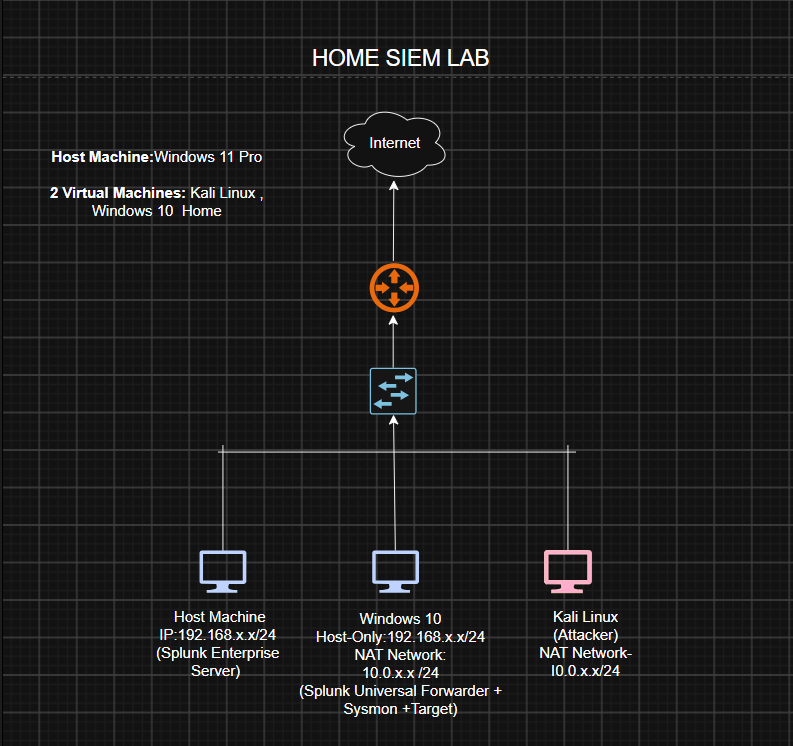

## Techniques & Activity Covered

| Activity | ATT&CK ID | Log source |
|---|---|---|
| PowerShell execution | T1059.001 | Sysmon EventID 1 |
| Scheduled task creation | T1053.005 | Sysmon EventID 1 (`schtasks.exe`) |
| SMB brute force | T1110 | Security 4625 |


## Setup

Universal Forwarder output, pointing to Splunk Enterprise on port 9997:

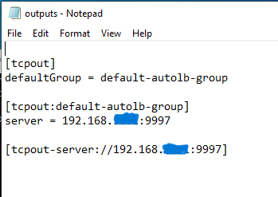

Sysmon events reaching Splunk (`index=main EventCode=1`):

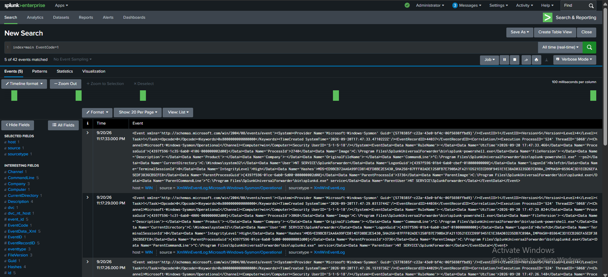

## 1. PowerShell (T1059.001)

**Simulation:** `Invoke-AtomicTest T1059.001`

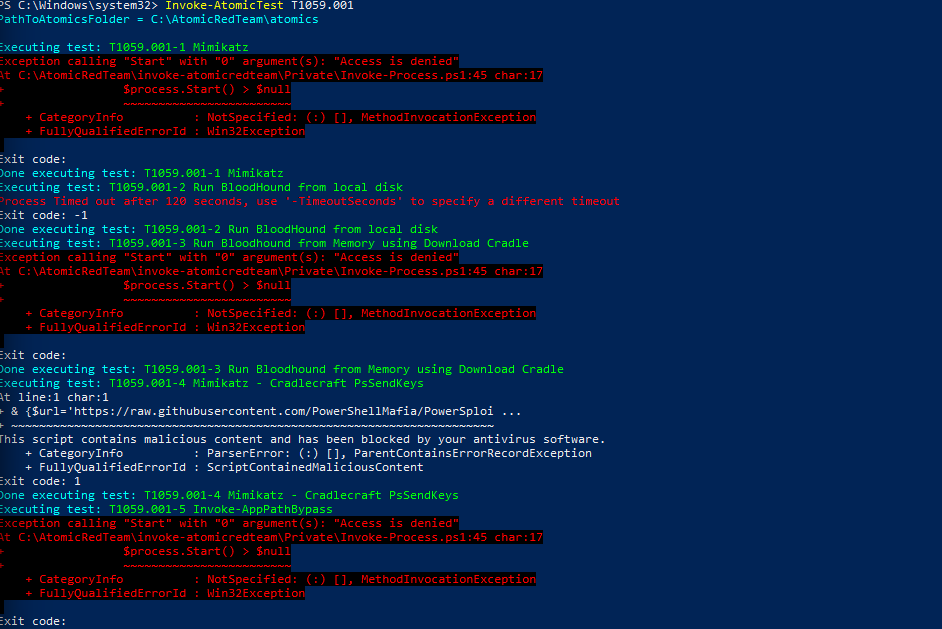

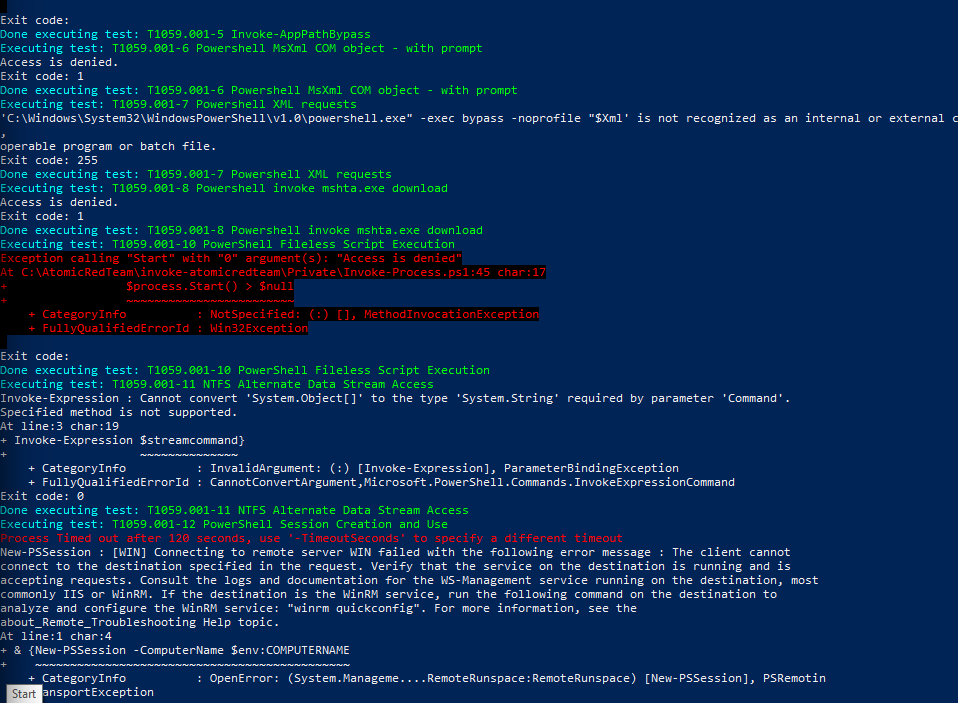

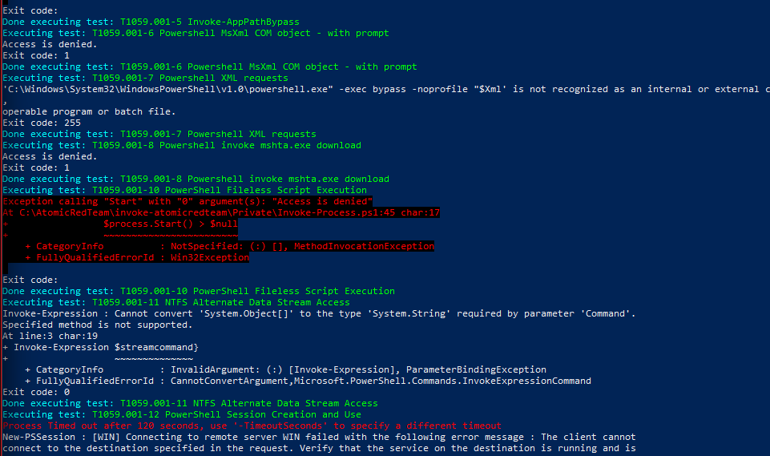

Some tests were blocked by antivirus or failed with "Access is denied". I kept those results in.

**Detection:** Sysmon EventID 1 showing `powershell -exec bypass`.

```spl
index=main bypass
```

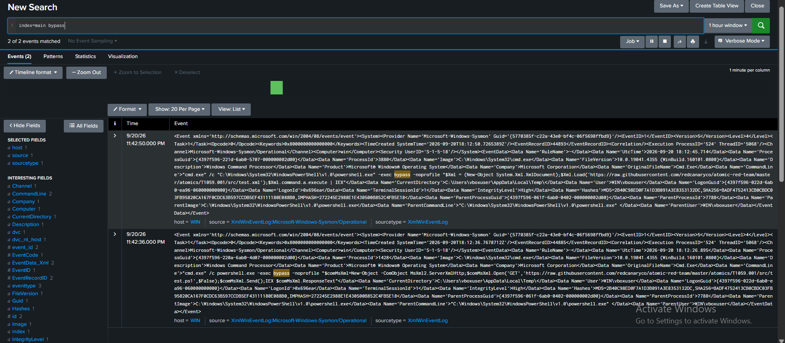

## 2. Scheduled Task Creation (T1053.005)

**Simulation:**

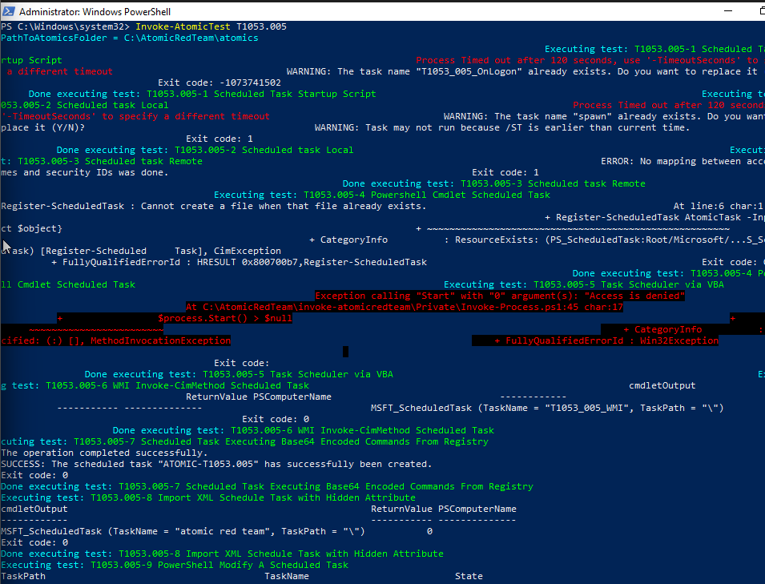

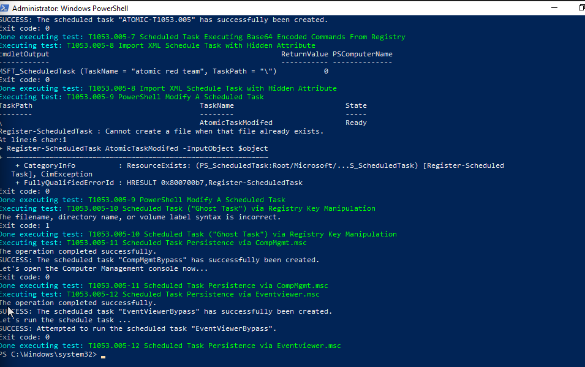

Tasks confirmed via:

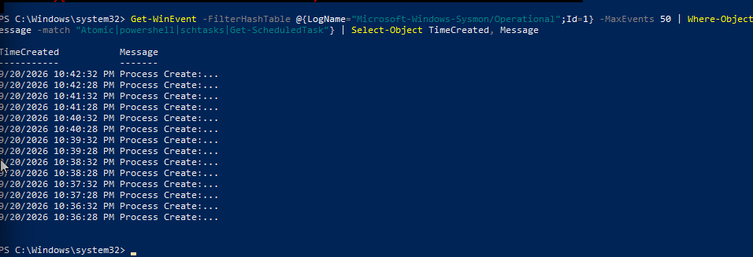

**Detection:** Security Event ID 4698 (scheduled task creation) was not being logged, since that audit subcategory wasn't enabled. Detection instead relies on Sysmon EventID 1, filtering for `schtasks.exe` in the command line:

```spl

index=main EventCode=1  CommandLine="schtasks.exe"
```

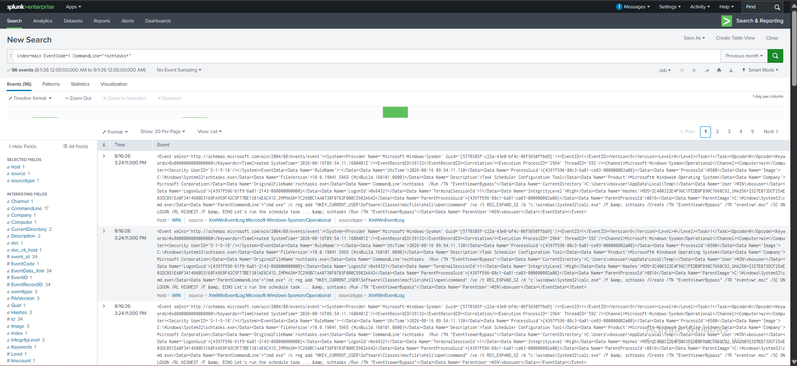

## 3. SMB Brute Force (T1110, Event ID 4625)

**Simulation:** Repeated SMB login attempts against the Windows 10 VM using `smbclient` from Kali, targeting a nonexistent share with the real `vboxuser` account and wrong passwords:

```bash
smbclient //192.168.56.102/SMBTest -U vboxuser
```

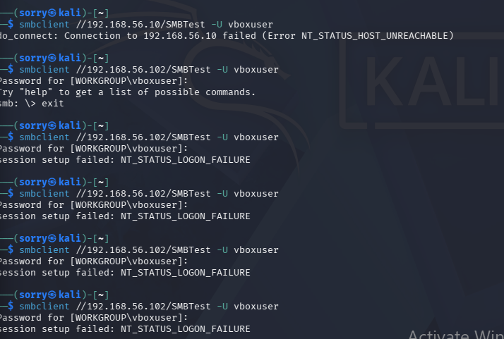

**Detection:**

```spl
index=main EventCode=4625
```

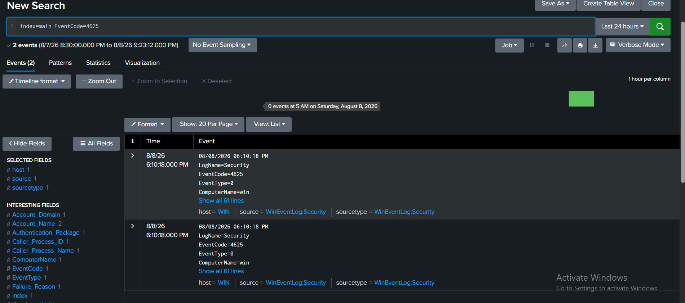

## Dashboard

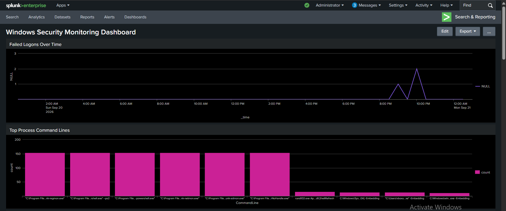

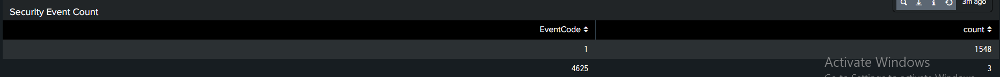

Panels: failed logons over time, top process command lines, security event counts by code.


