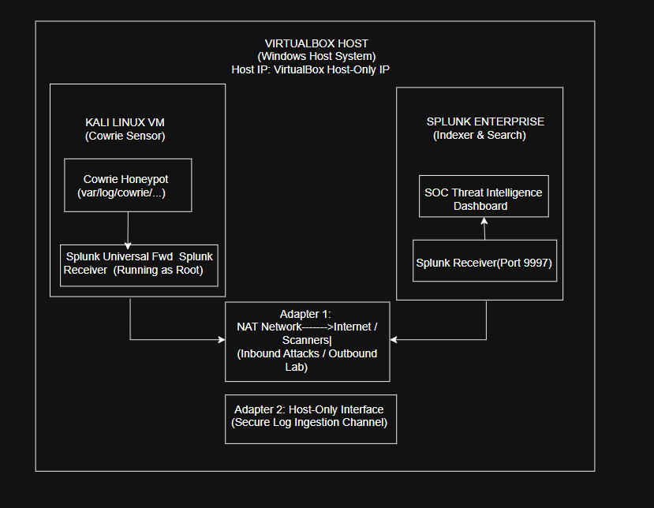
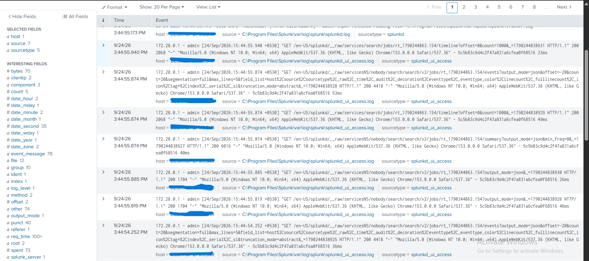
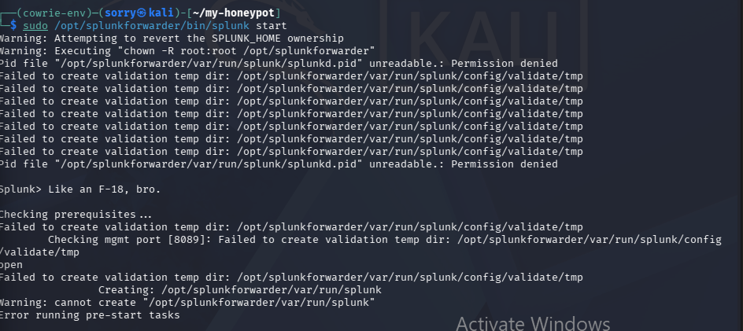
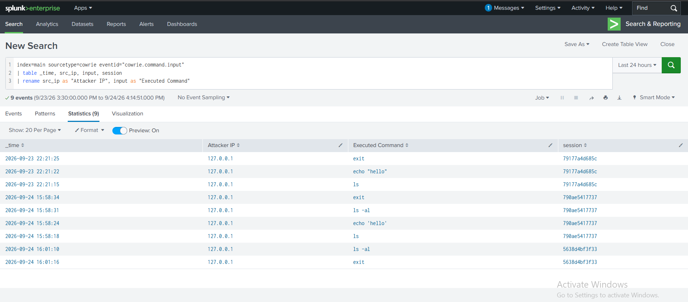
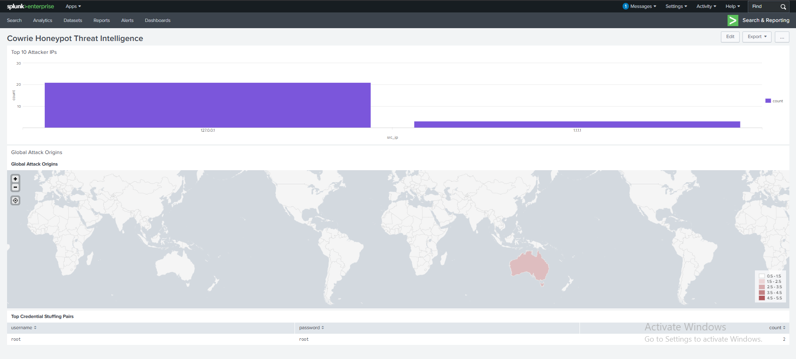

# Real-Time Honeypot Threat Monitoring Architecture: Cowrie to Splunk Enterprise

A hybrid threat intelligence pipeline designed to catch and analyze live automated SSH/Telnet attacks. The system disguises Cowrie (listening on port 2222) as a standard SSH service (port 22) on a Kali Linux sensor VM, streaming raw threat logs in real time to a Windows-hosted Splunk Enterprise SIEM over a secure dual adapter VirtualBox network.


## 1. Network & Attack Redirection Architecture

### Network Topology



### Network Adapter Breakdown
* **Adapter 1 (NAT Network - 'LabNetwork'):** Connects the Kali VM to the external gateway. It receives incoming attack traffic from automated scanners globally while allowing outbound updates.
* **Adapter 2 (Host-Only Adapter - 'VirtualBox Host-Only Ethernet Adapter'):** Establishes an isolated, high-speed private connection between Kali Linux and the Windows Host solely for secure log ingestion on port `9997`.

### Port Redirection Mechanism (The Illusion)
Attackers and automated botnets scan public IP space targeting standard **port 22** (SSH). An `iptables` NAT PREROUTING rule on Kali intercepts this traffic and transparently redirects it internally to **port 2222**, where Cowrie interacts with the attacker:


# Transparently redirect incoming SSH traffic from port 22 to Cowrie on port 2222
sudo iptables -t nat -A PREROUTING -p tcp --dport 22 -j REDIRECT --to-port 2222


## 2. Infrastructure Specifications

* **Sensor Endpoint:** Kali Linux VM (Dual Network Adapters: NAT Network + Host-Only)
* **SIEM / Indexer Endpoint:** Windows Host System running Splunk Enterprise.


* **Log Ingestion Pipeline:** `/home/sorry/my-honeypot/var/log/cowrie/cowrie.json` $\rightarrow$ Splunk Universal Forwarder $\rightarrow$ Host-Only Interface (`Port 9997`) $\rightarrow$ Splunk Receiver $\rightarrow$ `index=main` (`sourcetype=cowrie`)


## 3. Configuration Files

### Sensor Universal Forwarder (`Kali Linux`)

#### `/opt/splunkforwarder/etc/system/local/outputs.conf`

Routes all log data over the Host-Only interface to the Windows Host Receiver port:

```bash

[tcpout]
defaultGroup = default-autolb-group

[tcpout:default-autolb-group]
server = <HOST_ONLY_WINDOWS_IP>:9997

[tcpout-server://<HOST_ONLY_WINDOWS_IP>:9997]

```

#### `/opt/splunkforwarder/etc/system/local/inputs.conf`

Configures continuous file monitoring for the raw Cowrie JSON log output:

```bash

[default]
host = kali

[monitor:///home/sorry/my-honeypot/var/log/cowrie/cowrie.json]
disabled = 0
sourcetype = cowrie
index = main
crcSalt = <SOURCE>

```
### Indexer Parsing Configuration (`Windows Host`)

#### `C:\Program Files\Splunk\etc\system\local\props.conf`

Enables automatic key-value field extraction for incoming JSON events:

```bash

[cowrie]
KV_MODE = json
SHOULD_LINEMERGE = false
TIME_PREFIX = "timestamp":"
TIME_FORMAT = %Y-%m-%dT%H:%M:%S.%fZ
TRUNCATE = 0

```

## 4. Troubleshooting Log & Technical Obstacles

### Issue 1: Timezone Offset Search Discrepancies

* **Symptom:** Internal metrics (`index=_internal`) connected successfully, but raw `cowrie.json` searches returned `0 events`.


* **Root Cause:** Windows host operated on **+0530 (IST)** while the Kali VM generated timestamps on **-0400 (EDT)**. Default time filters omitted incoming events due to the delta.


* **Resolution:** Evaluated queries using explicit **"All time"** search windows during pipeline validation.



### Issue 2: Pre-Start Tasks Failure & Permission Lockouts

* **Symptom:** Executing `/opt/splunkforwarder/bin/splunk start` returned critical permissions errors:


Pid file "/opt/splunkforwarder/var/run/splunk/splunkd.pid" unreadable.: Permission denied

Failed to create validation temp dir: /opt/splunkforwarder/var/run/splunk/config/validate/tmp

Error running pre-start tasks




* **Root Cause:** Mixed usage of `sudo` and unprivileged execution locked file ownership under `/opt/splunkforwarder/var/`.


* **Resolution:** Executed recursive ownership updates to `root` and wiped stale process lock files:

sudo killall -9 splunkd

sudo chown -R root:root /opt/splunkforwarder

sudo chmod -R 777 /opt/splunkforwarder/var

sudo rm -f /opt/splunkforwarder/var/run/splunk/splunkd.pid

sudo /opt/splunkforwarder/bin/splunk start


### Issue 3: Stalled Ingestion Cache (Fishbucket Reset)

* **Symptom:** Universal Forwarder connected to the Indexer, but updates to `cowrie.json` were ignored by the file tailing engine.
* **Root Cause:** Splunk's `fishbucket` tracking index recorded a duplicate CRC header for the log file.
* **Resolution:** Cleared the internal file-tracking state cache to force complete reingestion:

sudo /opt/splunkforwarder/bin/splunk stop

sudo rm -rf /opt/splunkforwarder/var/lib/splunk/fishbucket

sudo /opt/splunkforwarder/bin/splunk start


## 5. SOC Threat Intelligence Dashboard

With `KV_MODE = json` configured, the following Search Processing Language (SPL) queries power the **Cowrie Threat Intelligence Dashboard**:


### 1. Top Attacker Source IPs (Bar Chart)

```spl
index=main sourcetype=cowrie src_ip=*
| stats count by src_ip
| sort - count
| head 10
| rename src_ip as "Attacker IP", count as "Total Connections"

```


### 2. Post-Exploitation Executed Commands (Table)

```spl
index=main sourcetype=cowrie eventid="cowrie.command.input"
| table _time, src_ip, input, session
| rename src_ip as "Attacker IP", input as "Executed Command"

```


### 3. Top Credential Stuffing Pairs (Table)

```spl
index=main sourcetype=cowrie eventid="cowrie.login.failed" OR eventid="cowrie.login.success"
| stats count by username, password
| sort - count
| head 15
| rename username as "Attempted Username", password as "Attempted Password", count as "Attempts"

```


### 4. Global Geographic Attack Origins (Choropleth Map)

```spl
index=main sourcetype=cowrie src_ip=*
| iplocation src_ip
| stats count by Country
| geom geo_countries featureIdField=Country

```

